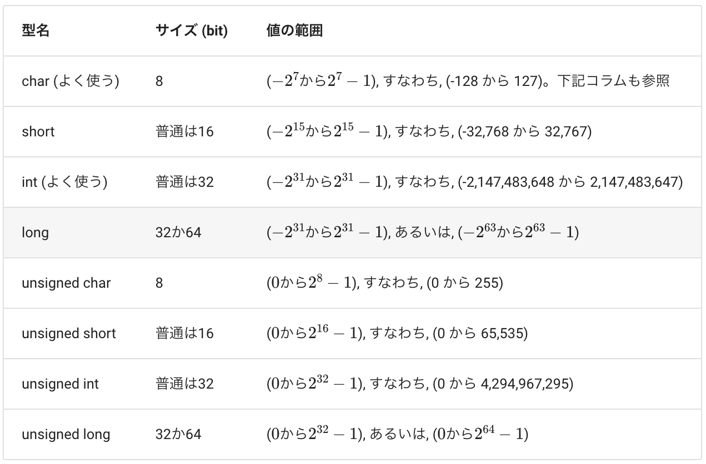
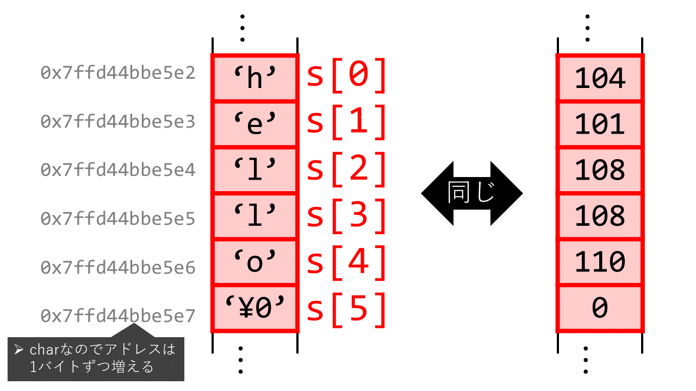

# Lecture Notes
\* Will be taking memos of stuff I didn't know

\* Lecture materials are found [here](https://eeic-software1.github.io/2023/)

## Main Objective
- **全員がポインタを理解することを目的とします**

## Lecture 1
Date: 2023/10/05; [Source code](week1)
### CLI
- Use `man` to show options of command
```shell
man mkdir
```
### Basic Data Types
- Can call a var name without value (int stands for integer), then initialize!
```C
int height, width;
```

- Once integer is initialized, it is mutable
```C
int height = 5;  // 宣言と同時に代入（初期化）
height = 12;  // 値の上書き
```
- **List of integer data types**



- For real numbers, there are **float** and **double**

- **char** value has a max of 127, if over that, it will implicitly be changed to an **int**
```C
char c3 = 140;
printf("%d", c3);
>>> -116
```

- Variable values are stored in 64bit integer addresses and when called with `&var_name`, the leading address will be represented in base-16
```C
printf("&p", &height);
>>> 0x7fff138be160
```

### More on Memory
- Memory in computer is made of a list 8-bit blocks. Each blocks has its own address of 64-bit integer

- For example, an int data type has 32 bits, so it is consisted of 4 blocks `00000000|00000000|00000000|00001010`


## Lecture 2
Date: 2023/10/12; [Source code](week2)

### Basic Operations
- `&&` : and, `||` : or

- Difference of `++a` and `a++`

```C
int x = 0, y = 0, a = 0, b = 0;
x = ++a;  // xは1になる
y = b++;  // yは0になる
```

- Difference of casting and initiating as a literal

```C
char c = 0;
int i = (int)c;

int i;
float f;
f = i = 23.5f;
```
 We cast on the top one and initializes 23.5 as a float on the bottom one

### Controls
- **文 vs 式**. 「式;」を「文」と呼ぶ

- **Blocks**

```C
{
    // 複数の文をまとめてブロックにする
    a = 3;
    b += 2;
    int c = 123;  // ブロック内で宣言した変数はブロックの内側でしか使えない
}
// カッコの最後にはセミコロンが無いことに注意
// ブロックを抜けたあとではcにはアクセスできない
```

### Array
- Initiating arrays
```C
int a[3];  // int型が3つ並んだ配列
a[0] = 12;
a[1] = 3;
a[2] = 5;   // 最後。
```
OR
```C
int a[3] = {12, 3, 5};

// さらに省略。
int a[] = {12, 3, 5};
```
For n-dimension arrays,
```C
int mat[2][3] = {
    {32,  5, 76},
    { 1, 12,  8}
};
```
- In memory, a 1-d array will store 3 `int`s in consecutive addressses. n-d arrays will store elements first row ([0][0]..[i]) first.

### Loops
- **Break** leaves the loop. **Continue** skips the loop for one increment only

- **Switch** is like an if statement
```C
int school_year = 2;  // 大学2年生
switch (school_year)
{
    case 1:
    case 2:
        printf("You are studying at Komaba\n");
        break;
    case 3:
    case 4:
        printf("You are studying at Hongo\n");
        break;
    default:
        printf("Error\n");
        break;
}
```
### Function Semantics
- Function **passes a copy of the value** and can't update variabes.
```C
void plus_one(int a) {
    a++;
}

int main () {
    int b = 10;
    plus_one(b);
    printf("%d\n", b); // 10のまま
}
```
- **Scopes**. Variable inside block is prioritized
```C
int a = 0; // グローバル変数

void f() {
    int a = 3;  // グローバル変数と同じ名前のローカル変数
    ++a;
}
...
```

### Quiz
Why is `double a = 3 / 2` not `1.5`?

- 3 and 2 are integers so 3/2 will be `1`

What are values of i and f?
```C
int i;
float f;
f = i = 23.5f;
```
- Both will be 23. Bcs `f = (i = 23.5f)`

Why does `a < b < c` not work?

- `<` is a left bond. It will be evaluated to `(-20 < -10) < -2` then `1 < -2`

## Lecture 3

### Strings and Characters
In `C`, we differentiate strings and characters. Characters are singular letters and the whole thing is a string (文字列). **But both are called with `char`.**
```C
int main() {
    char s[6] = "hello";
    char s[] = "hello";
}
```
Characters are stored very similarly to arrays



```C
char s2[8] = "hello"; // {'h', 'e', 'l', 'l', 'o', '\0', '\0', '\0'};
char s3[3] = "hello";  // {'h', 'e', 'l'};
```

Just like arrays, the address of a string is the address of the first character.

```C
int a[3] = {1, 2, 3};
printf("%p %p\n", a, &a[0]); // 同じになる。例えば 0x7fffd6711a90 0x7fffd6711a90
```

Not possible to compare Strings because using `==` will compare address instead.
```C
char s1[] = "abc";
char s2[] = "abc";
if (s1 == s2) { ... }  // 想定した挙動にならない。常に偽になる
```

### sizeof()
sizeof returns the number of bytes. If an array is given, will multiply.
```C
printf("%lu\n", sizeof(char)); // 1
printf("%lu\n", sizeof(int));  // 4

int a[] = {1, 2, 3};
printf("%lu\n", sizeof(a));  // 12
```

### Inputing an array as function
```C
int count_spaces(char s[]) {
    int ct = 0;
    for (int i = 0; s[i] != '\0'; ++i) {
        if (s[i] == ' ') {
            ++ct;
        }
    }
    return ct;
}
```

When doing sizeof() for strings, it will count the last `'\0'`
```C
char s[] = "abc";
printf("%lu\n", sizeof(s)); // 4
```

### <string.h>
Functions for strings
- `strlen`: length of string. Without `'\0'`
- `strcpy`: copy a string
- `strcat`: concatenate a string
- `strcmp`: compare string

```C
int main() {
    char s1[] = "abc";
    unsigned long len = strlen(s1);  // 長さを取得
    printf("sizeof(s1): %lu, strlen(s1): %lu\n", sizeof(s1), len);  // sizeof: 4, strlen: 3

    char s2[10];  // 十分に長く確保
    strcpy(s2, "hello");
    printf("%s\n", s2);  // 文字列をコピー。 s2 = "hello" 的なもの。
    printf("sizeof(s2): %lu, strlen(s2): %lu\n", sizeof(s2), strlen(s2)); // sizeof: 10, strlen: 5

    char s3[10] = "hoge";  // 十分に長く確保
    printf("sizeof(s3): %lu, strlen(s3): %lu\n", sizeof(s3), strlen(s3)); // sizeof: 10, strlen: 4
    strcat(s3, "fuga");  // 文字列を結合する。stringのconcatenate
    printf("%s\n", s3); // "hogefuga"
    printf("sizeof(s3): %lu, strlen(s3): %lu\n", sizeof(s3), strlen(s3)); // sizeof: 10, strlen: 8

    char s4[] = "abc";
    char s5[] = "abcd";
    int cmp = strcmp(s4, s5); // 文字列の比較。s4 == s5的なもの。二つの文字列の辞書順に応じて、正か0か負になる
    printf("%d\n", cmp);  // ここでは-100
}

```
### Quiz
1. How to get an int from the string?
```C
int n = c - '0'
```
2. How to get the lowercase of a given character?
```C
c = c - 'A' + 'a';
```
3. `0`と、`'0'`と、`'\0'`と、`"0"`と、`"\0"`の違い
    - Integer
    - ASCII that represents 0
    - ASCII that represents NULL
    - String
    - String

### Transforming types
In C, types are transformed automatically.

Types are converted automatiaccaly when
1. Handling operations
2. Subtitution `int a = b`
3. When input does not matched defined in function
4. When output does not matched defined outside function

```C
char c = 12;     // 8 bit
short s = 34;    // 16 bit
int i = 56;      // 32 bit
float f = 1.0;   // 32 bit
double d = 2.0;  // 64 bit
i = i + c;       // i + cで、cがintに変換される
i = i + s;       // i + sで、sがintに変換される
f = f + i;       // f + iで、iがfloatに変換される
d = d + f;       // d + fで、fがdoubleに計算される
```
### Cast
```C
float quotient;
int dividend = 3, divisor = 2;

// キャスト無し
quotient = dividend / divisor; // 1.000

// キャストあり
quotient = (float) dividend / divisor;  // 1.5000
```

### Input and Outputs
Use `getchar()` and `putchar()` to take input and output

```C
#include <stdio.h>

int main() {
    int c = getchar();
    while (c != EOF) {
        putchar('/');  // 複写プログラムに加え、文字の間にスラッシュをいれる
        putchar(c);
        c = getchar();
    }
}
```
Use a `|` to combine shell commands
```shell
$ echo abcd | ./a.out
/a/b/c/d/
```

### Bash
Use `grep` to search for a word in ls by combining with ls
```Bash
ls -al | grep mkdir
```

## Lecture 4

### DEFINE!
We can define a constant variable using `#define N 5`. No matter where it is, all `N` will be substituted as 5.
```C
#define N 5

int main() {
    for (int i = 0; i < N ...)
}
```

### Pointers
Think of pointers as a variable that holds another variable's address. The tricky part of pointers in C is that we use `*` to initiate pointers and also `*` to access the value of pointer.

```C
// We have to state what is the varaible's type when initiating pointer
double a = 10.0;
double *p;
p = &a;
```

Becareful that `*` just means pointer for the next variable

```C
int* p1, p2, p3; => p1 is pointer of int, p2 and p3 are ints
```

Make two varaibles point at the same memory space using pointers

```C
int a = 10;
int *p;
p = &a;  // p は aを指す

int *q; // もう一個ポインタを宣言
q = p;  // q = &a と同じ意味
```


### Pointers as input of functions
In C, we could only get one return per function so instead, we could pass in pointers and change value pointed by pointers for multiple inputs.

```C
void decompose(double x, long *int_part, double *frac_part) {
    *int_part = (long) x;
    *frac_part = x - *int_part;
}

int main() {
    long n;
    double d;
    decompose(3.14, &n, &d)
}
```

When using the function decompose, we are passing a copy of each address. However, we can access the "real" value through the address, so we can edit the actual values.

### Returning a pointer
We can also create functions that return pointers.
```C
int *min(int *a, int *b) {
    if (*a < *b) {
        return a;
    } else {
        return b;
    }
}

int main() {
    int *ret;
    ret = min(&num1, *num2);
}
```
The function above will return the address of minimum value.

Btw, if you intitiate local varaible inside function, you cannot return the address of it.


### Quiz
```C
int a = 10;
int *p = &a;
```
What do these expressions mean?
- `*&a`

`a`
- `&*a`

error.
- `*&p`

p
- `&*p`

a's address.

### Pointer and arrays
```C
int a[3] = {12, 3, 5};
int *p = &a[0];  // &(a[0])のこと
int *p =&a; // Still same
*p = 2; // a become {2, 3, 5}
```

When incrementing address of array, we will go to the next elements


The above is equivalent to,

```C
q = p + sizeof(int) * 2;
```

Why is the code below okay?
```C
for (int *p = &a[0]; p < &a[N]; ++p) { ... }
```
Because, although `int a[N]` is not defined, the address `&a[N]` is defined! Recall that in memory space, after the last element, there will be `!0`


From the picture above, we realise that a pointer pointing at the start of an array is very similar to the just the array variable. But there are inherent differences


We can't equate it to a `NULL`
```C
int a[] = {1, 2, 3, 4, 5}, *p;
p = a;
int *r = NULL;
p = r;  // 出来る（ポインタにポインタを代入）
a = r;  // 出来ない（aは固定されている配列アドレスなので、別のものを代入できない）
```

Different `sizeof()`
```C
int a[] = {1, 2, 3, 4, 5}, *p;
p = a;
printf("sizeof(p): %lu\n", sizeof(p)); // sizeof(p): 8
printf("sizeof(a): %lu\n", sizeof(a)); // sizeof(a): 20
```
